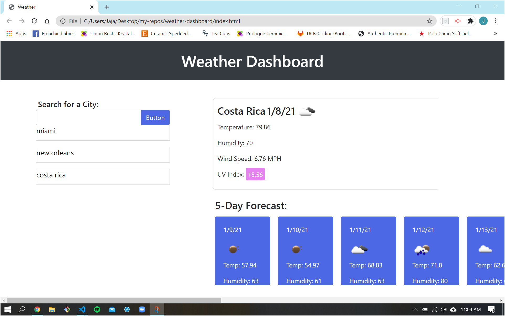

# weather-dashboard

A weather application that allows users to search specific locations for the current weather, along with a 5 day forecast. The searched location is diplayed on the screen with the date and current weather condtions.

## Getting Started

Cloning repository to local directory

1. Open your terminal (MAC) or Git Bash (PC).
2. Navigate to prefered directory.
3. Run: **_git clone url_**.

## Built With

- [HTML](https://developer.mozilla.org/en-US/docs/Web/HTML)
- [CSS](https://developer.mozilla.org/en-US/docs/Web/CSS)
- [JavaScript](https://developer.mozilla.org/en-US/docs/Web/JavaScript)

## Deployed Link

- [Live site link]()



## Code Snippets

```
 $.ajax({
    url: queryURL,
    method: "GET",
  }).then(function (response) {
    console.log(response);

    var currentLoc = response.name;
    var currentDate = moment().format("M/D/YY");
    var currentTemp = response.main.temp;
    var currentHumid = response.main.humidity;
    var windSpd = response.wind.speed;
    var wthIcon = response.weather[0].icon;
    var icon = "https://openweathermap.org/img/w/" + wthIcon + ".png";

    //rendering text and attributes
    //of the HTML elements
    $("#location").text(currentLoc);
    $("#loc-date").text(currentDate);
    $("#icon1").attr("src", icon);
    $("#temp").text(`Temperature: ${currentTemp}`);
    $("#humid").text(`Humidity: ${currentHumid}`);
    $("#wind-spd").text(`Wind Speed: ${windSpd} MPH`);

    //variables for lat and lon
    var lat = response.coord.lat;
    var lon = response.coord.lon;


```

# Authors

- **Jaja Brown**
  - [Link to Portfolio]()
  - [Link to Github](https://github.com/jbrown827)
  - [Link to LinkedIn](https://www.linkedin.com/in/jaja-brown-a42261201/)

## Acknowledgments
